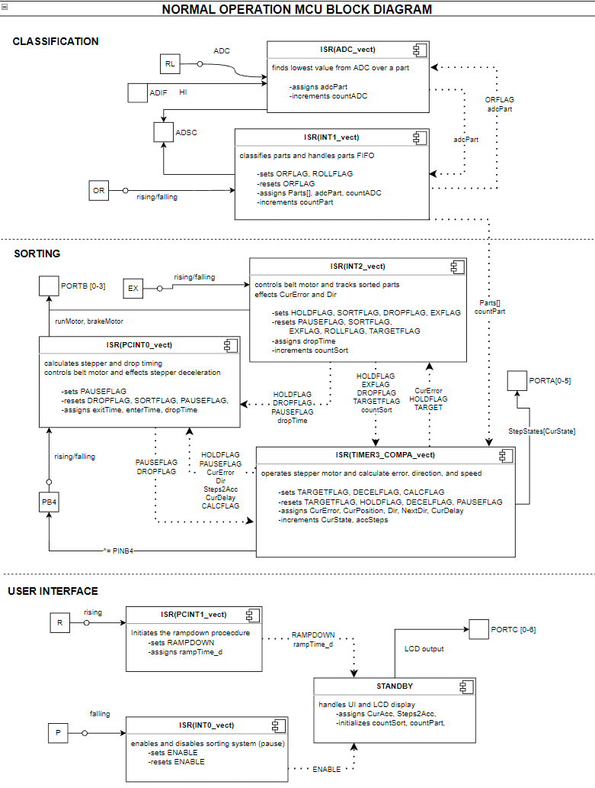
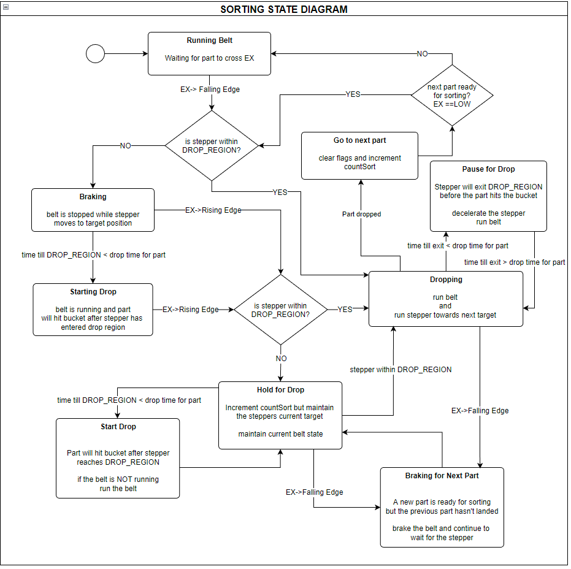
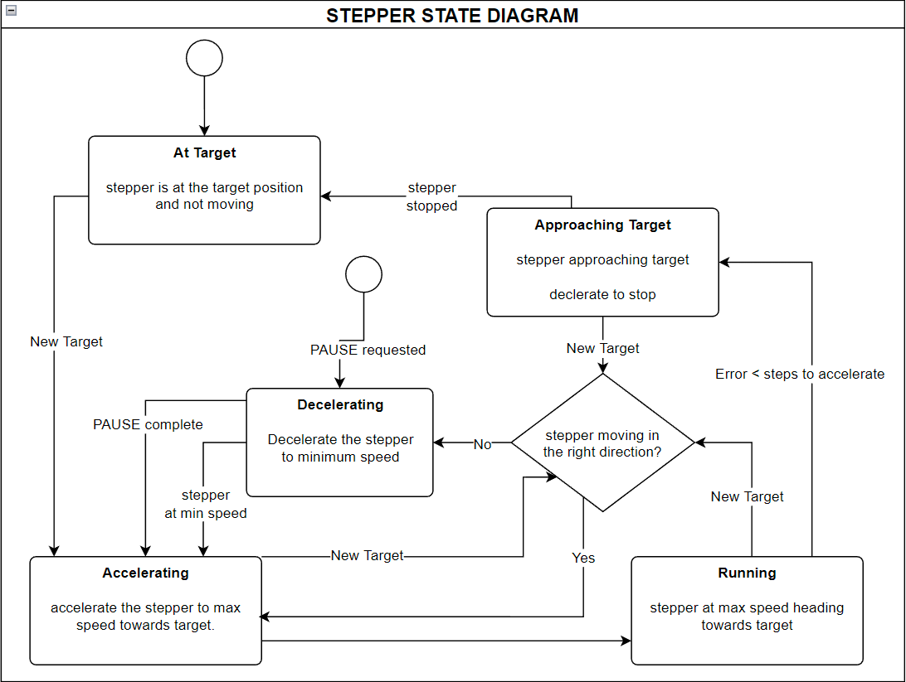

# Optimized_Sorting_Machine
A linear conveyor sorting machine designed as a project for MECH458 and the University of Victoria

A full description, diagrams, and report can be found in docs
Some sample block diagrams are shown below.

